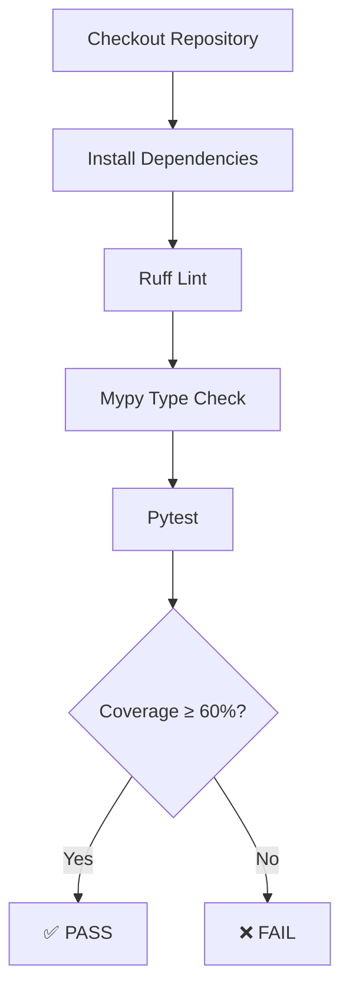

## GitHub Actions CI Pipeline

```mermaid
flowchart TD
    A[Checkout Repository] --> B[Install Dependencies]
    B --> C[Ruff Lint]
    C --> D[Mypy Type Check]
    D --> E[Pytest]
    E --> F{Coverage ≥ 60%?}
    F -->|Yes| G[✅ PASS]
    F -->|No| H[❌ FAIL]
```