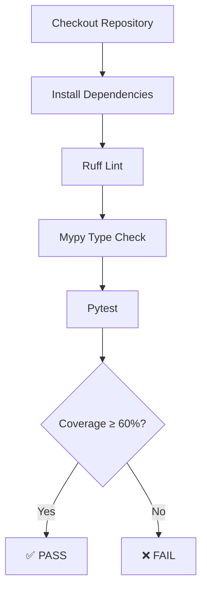

## 🤖 📖 🚀 🧠 💻 AI Project ⚙️ 🗂️ 🧪 🔌 🛠️ 📦 
## Ferocious Minsky

A from-scratch machine learning library and experimental framework for studying supervised and unsupervised learning algorithms, ensemble methods, model robustness, bias–variance behavior, scalability, and clustering performance.

The project was developed by **Madagascar Penguins** as a final machine learning project for the **AI Academy, National AI Center — Spring 2026**.

Unlike projects that only train ready-made models from existing libraries, Ferocious Minsky implements the main machine learning algorithms directly using Python and NumPy. Scikit-learn is used primarily for dataset access, preprocessing support, comparison baselines, cross-validation utilities, and validation of the custom implementations.

The project includes custom implementations of:

* Decision Tree Classifier
* Decision Stump
* AdaBoost Classifier
* Random Forest Classifier
* Principal Component Analysis
* K-Means Clustering
* DBSCAN Clustering
* Classification metrics
* Bias–variance decomposition
* Label-noise robustness experiments
* AdaBoost scaling experiments
* Supervised and unsupervised evaluation pipelines

---

## Table of Contents

* [Project Overview](#project-overview)
* [Research Objectives](#research-objectives)
* [Main Features](#main-features)
* [Implemented Algorithms](#implemented-algorithms)
* [Project Structure](#project-structure)
* [Technology Stack](#technology-stack)
* [Installation](#installation)
* [Dataset Setup](#dataset-setup)
* [Quick Start](#quick-start)
* [Supervised Learning](#supervised-learning)
* [Unsupervised Learning](#unsupervised-learning)
* [Evaluation Metrics](#evaluation-metrics)
* [Experiment Pipelines](#experiment-pipelines)
* [Bias–Variance Analysis](#biasvariance-analysis)
* [Noise Robustness](#noise-robustness)
* [AdaBoost Scaling Experiments](#adaboost-scaling-experiments)
* [Notebooks](#notebooks)
* [Figures](#figures)
* [Testing](#testing)
* [Code Quality](#code-quality)
* [Continuous Integration](#continuous-integration)
* [Reproducibility](#reproducibility)
* [Reports and Presentation](#reports-and-presentation)
* [Limitations](#limitations)
* [Future Improvements](#future-improvements)
* [Contributing](#contributing)
* [License](#license)

---

# Project Overview

Ferocious Minsky is a modular machine learning project created to investigate how classical learning algorithms behave under different datasets, noise levels, model configurations, and experimental conditions.

The central supervised-learning focus of the project is the comparison between two major ensemble-learning strategies:

* **Boosting**, represented by AdaBoost
* **Bagging**, represented by Random Forest

These approaches improve predictive performance in different ways.

AdaBoost trains weak learners sequentially and places more emphasis on samples that previous learners classified incorrectly. Its primary effect is often associated with reducing model bias.

Random Forest trains multiple decision trees independently using bootstrap samples and randomized feature selection. Its primary effect is often associated with reducing model variance.

The project also includes unsupervised learning algorithms to analyze the internal structure of datasets independently from their labels. PCA is used for dimensionality reduction, while K-Means and DBSCAN are used for clustering and structure discovery.

The repository combines:

* Algorithm implementation
* Dataset preprocessing
* Experimental evaluation
* Visualization
* Statistical comparison
* Automated testing
* Static code analysis
* Continuous integration
* Technical documentation
* Academic reporting

---

# Research Objectives

The project is designed around several practical and theoretical questions.

## Ensemble Learning

The supervised experiments investigate questions such as:

* Under what conditions does AdaBoost outperform Random Forest?
* When is bagging more robust than boosting?
* How do Decision Trees compare with ensemble methods?
* How does model performance change across binary and multiclass datasets?
* How do custom implementations compare with scikit-learn baselines?
* How does ensemble size affect model accuracy and runtime?

## Bias and Variance

The project evaluates:

* Whether boosting reduces bias
* Whether bagging reduces variance
* How prediction variability changes across bootstrap samples
* Whether the empirical decomposition satisfies:

```text
Total Error = Bias² + Variance
```

## Noise Robustness

The robustness experiments investigate:

* How label noise affects AdaBoost
* How label noise affects Random Forest
* Which model degrades more rapidly as noise increases
* Whether dataset properties influence sensitivity to incorrect labels

## Unsupervised Learning

The unsupervised analysis investigates:

* How much variance PCA preserves
* Whether the original labels correspond to naturally separable clusters
* How K-Means behaves on different datasets
* How DBSCAN identifies dense regions and noise
* How clustering performance changes with parameter selection
* Whether dimensionality reduction improves visual interpretation

---

# Main Features

## Algorithms Implemented from Scratch

The project contains custom implementations of the main algorithms rather than wrapping equivalent scikit-learn estimators.

Implemented supervised algorithms:

* Decision Tree Classifier
* Decision Stump
* AdaBoost Classifier
* Random Forest Classifier

Implemented unsupervised algorithms:

* Principal Component Analysis
* K-Means
* DBSCAN

## Custom Metrics

The repository provides NumPy-based implementations of:

* Accuracy
* F1-score
* Confusion matrix
* AUC-ROC

## Experiment Framework

The project includes reusable workflows for:

* Baseline model comparison
* Five-fold cross-validation
* Bias–variance decomposition
* Label-noise robustness
* AdaBoost estimator-scaling analysis
* PCA visualization
* K-Means clustering evaluation
* DBSCAN parameter search
* Automatic figure generation

## Dataset Utilities

Dataset utilities provide:

* Dataset downloading
* Dataset caching
* Train-test splitting
* Standardization
* DataFrame memory optimization
* NumPy dtype optimization
* Missing-value handling
* Deterministic subsampling

## Engineering Quality

The repository also includes:

* 124 automated tests
* Pytest test suite
* Coverage reporting
* Ruff linting
* Mypy type checking
* GitHub Actions CI
* Fixed random seeds
* Mock-based integration tests
* Academic report sources
* Presentation sources

At the time of validation, the complete test suite passed with approximately **75% source-code coverage**, exceeding the CI requirement of 60%.

---

# Implemented Algorithms

# 1. Decision Tree Classifier

Location:

```text
src/trees/decision_tree.py
```

The custom Decision Tree follows the main principles of CART-style classification trees.

The model recursively divides the feature space by selecting feature thresholds that produce the greatest impurity reduction.

## Supported Functionality

* Binary classification
* Multiclass classification
* Continuous numeric features
* Gini impurity
* Entropy
* Maximum tree depth
* Minimum samples required for splitting
* Feature subsampling
* Sample weights
* Class prediction
* Probability prediction
* Feature importance
* Reproducible random behavior

## Gini Impurity

Gini impurity measures how mixed the classes are inside a node.

```text
Gini = 1 - Σ p(c)²
```

where `p(c)` is the proportion of samples belonging to class `c`.

A pure node has a Gini impurity of zero.

## Entropy

Entropy measures uncertainty in the class distribution.

```text
Entropy = -Σ p(c) log₂(p(c))
```

A node containing only one class has zero entropy.

## Tree Growth

For each candidate feature, the tree examines possible split thresholds and measures the impurity reduction produced by each split.

The best split is selected according to the configured criterion.

Tree growth stops when one or more stopping conditions are met:

* Maximum depth has been reached
* The node contains fewer than `min_samples_split` samples
* All samples in the node belong to the same class
* No valid split improves impurity
* No valid threshold can divide the node

## Basic Usage

```python
from src.trees.decision_tree import DecisionTree

model = DecisionTree(
    max_depth=5,
    min_samples_split=2,
    criterion="gini",
    random_state=42,
)

model.fit(X_train, y_train)

predictions = model.predict(X_test)
probabilities = model.predict_proba(X_test)
```

Feature importance can be accessed after training:

```python
print(model.feature_importances_)
```

---

# 2. Decision Stump

Location:

```text
src/trees/boosting/adaboost.py
```

A Decision Stump is a Decision Tree with a maximum depth of one.

It performs only one split and is therefore considered a weak learner.

The Decision Stump is used as the base estimator in the custom AdaBoost implementation.

```python
from src.trees.boosting.adaboost import DecisionStump

stump = DecisionStump(random_state=42)
stump.fit(X_train, y_train)

predictions = stump.predict(X_test)
```

Although an individual stump usually has limited predictive power, AdaBoost combines many stumps to create a stronger classifier.

---

# 3. AdaBoost Classifier

Location:

```text
src/trees/boosting/adaboost.py
```

AdaBoost is a sequential ensemble-learning method.

Each weak learner is trained using sample weights. Samples that are classified incorrectly receive greater importance during subsequent rounds.

The implementation follows the **SAMME** multiclass boosting strategy.

## Training Workflow

For each boosting round:

1. Train a Decision Stump using the current sample weights.
2. Generate predictions for the training data.
3. Calculate the weighted classification error.
4. Calculate the estimator weight.
5. Increase the importance of incorrectly classified samples.
6. Normalize the sample weights.
7. Store the trained estimator and its contribution weight.

## Main Features

* Binary classification
* Multiclass classification
* Weighted training
* Decision Stump base learners
* Estimator error tracking
* Estimator weight tracking
* Early termination
* Class probability prediction
* Staged prediction
* Fixed random-state support

## Basic Usage

```python
from src.trees.boosting.adaboost import AdaBoostClassifier

model = AdaBoostClassifier(
    n_estimators=100,
    learning_rate=1.0,
    random_state=42,
)

model.fit(X_train, y_train)

predictions = model.predict(X_test)
probabilities = model.predict_proba(X_test)
```

The contribution of each estimator can be inspected through the fitted model attributes:

```python
print(model.estimator_weights_)
print(model.estimator_errors_)
```

## Staged Predictions

Staged prediction makes it possible to observe model performance after each boosting round.

```python
for estimator_count, predictions in enumerate(
    model.staged_predict(X_test),
    start=1,
):
    print(estimator_count, predictions)
```

This feature is used by the AdaBoost scaling experiments to track training and test performance as the number of estimators grows.

---

# 4. Random Forest Classifier

Location:

```text
src/trees/bagging/random_forest.py
```

Random Forest is a bagging-based ensemble that combines many independently trained Decision Trees.

Each tree is trained on a bootstrap sample of the original training data. During tree construction, only a randomly selected subset of features is considered at each split.

These sources of randomness help reduce correlation among individual trees.

## Training Workflow

For every tree:

1. Draw a bootstrap sample from the training dataset.
2. Track samples that were not selected.
3. Train a custom Decision Tree.
4. Randomly select candidate features during splitting.
5. Store the fitted tree.
6. Optionally collect out-of-bag predictions.

During prediction:

1. Every tree generates a class prediction or class probability.
2. Predictions are combined across the forest.
3. Majority voting determines the final class.
4. Probability outputs are averaged.

## Main Features

* Custom Decision Tree base learner
* Bootstrap sampling
* Optional non-bootstrap training
* Random feature selection
* Majority voting
* Probability averaging
* Out-of-bag scoring
* Parallel tree training
* Multiclass support
* Feature importance aggregation
* Reproducible random behavior

## `max_features`

Supported configurations include:

```python
max_features="sqrt"
```

Uses approximately the square root of the available feature count.

```python
max_features="log2"
```

Uses approximately the base-2 logarithm of the available feature count.

```python
max_features=5
```

Uses a fixed number of candidate features.

```python
max_features=None
```

Allows every feature to be considered.

## Basic Usage

```python
from src.trees.bagging.random_forest import RandomForestClassifier

model = RandomForestClassifier(
    n_estimators=100,
    max_depth=None,
    min_samples_split=2,
    max_features="sqrt",
    bootstrap=True,
    oob_score=True,
    n_jobs=-1,
    random_state=42,
)

model.fit(X_train, y_train)

predictions = model.predict(X_test)
probabilities = model.predict_proba(X_test)
```

After training:

```python
print(model.feature_importances_)
```

When out-of-bag evaluation is enabled:

```python
print(model.oob_score_)
```

## Parallel Training

The `n_jobs` parameter controls the number of worker processes.

```python
n_jobs=1
```

Runs tree training sequentially.

```python
n_jobs=-1
```

Uses all available CPU cores.

Parallel execution is most useful when the forest contains many trees or is trained on larger datasets.

---

# 5. Principal Component Analysis

Location:

```text
src/unsupervised/pca.py
```

Principal Component Analysis is a dimensionality-reduction method.

PCA transforms the original features into a smaller collection of orthogonal components ordered by the amount of variance they explain.

## Main Features

* Mean centering
* Covariance-matrix calculation
* Eigenvalue decomposition
* Component ordering
* Dimensionality reduction
* Explained variance
* Explained variance ratio
* `fit`
* `transform`
* `fit_transform`

## Basic Usage

```python
from src.unsupervised.pca import PCA

pca = PCA(n_components=2)

X_reduced = pca.fit_transform(X)
```

Fitted attributes include:

```python
print(pca.components_)
print(pca.explained_variance_)
print(pca.explained_variance_ratio_)
print(pca.mean_)
```

PCA is used throughout the project for:

* Two-dimensional visualization
* Feature-space inspection
* Clustering visualization
* Explained-variance analysis
* Preprocessing before graphical comparison

---

# 6. K-Means Clustering

Location:

```text
src/unsupervised/kmeans.py
```

K-Means partitions samples into a predefined number of clusters.

The model alternates between assigning samples to the nearest centroid and recalculating the centroid of each cluster.

## Algorithm Workflow

1. Initialize cluster centroids.
2. Assign every sample to the nearest centroid.
3. Recalculate each centroid using its assigned samples.
4. Repeat until convergence or until the iteration limit is reached.

## Main Features

* Configurable number of clusters
* Multiple initialization runs
* Maximum iteration control
* Convergence tolerance
* Cluster prediction
* Inertia calculation
* Reproducibility
* Empty-cluster handling
* `fit`
* `predict`
* `fit_predict`

## Basic Usage

```python
from src.unsupervised.kmeans import KMeans

model = KMeans(
    n_clusters=3,
    n_init=10,
    max_iter=300,
    tol=1e-4,
    random_state=42,
)

labels = model.fit_predict(X)
```

Fitted information includes:

```python
print(model.centroids_)
print(model.labels_)
print(model.inertia_)
print(model.n_iter_)
```

The project evaluates K-Means using:

* Inertia
* Adjusted Rand Index
* PCA-based cluster visualization
* Multiple values of `k`

---

# 7. DBSCAN

Location:

```text
src/unsupervised/dbscan.py
```

DBSCAN is a density-based clustering algorithm.

Unlike K-Means, DBSCAN does not require the number of clusters to be specified in advance.

It groups points that belong to sufficiently dense neighborhoods and marks isolated points as noise.

## Main Concepts

### `eps`

The maximum distance between two samples for them to be considered neighbors.

### `min_samples`

The minimum number of neighboring samples required for a point to be considered a core point.

### Noise

Points that do not belong to any cluster are assigned the label:

```text
-1
```

## Main Features

* Core-point detection
* Neighborhood expansion
* Arbitrary cluster shapes
* Noise identification
* Cluster-count tracking
* Core sample indices
* `fit`
* `fit_predict`

## Basic Usage

```python
from src.unsupervised.dbscan import DBSCAN

model = DBSCAN(
    eps=0.5,
    min_samples=5,
)

labels = model.fit_predict(X)
```

Fitted attributes include:

```python
print(model.labels_)
print(model.core_sample_indices_)
print(model.n_clusters_)
```

The project also includes automated `eps` evaluation to compare candidate values according to:

* Number of detected clusters
* Adjusted Rand Index
* Noise fraction

---

# Project Structure

```text
Ferocious_Minsky-main/
│
├── .github/
│   └── workflows/
│       └── ci.yml
│
├── contribution/
│   ├── README.md
│   ├── contribution_report.pdf
│   └── contribution_report.tex
│
├── data/
│   ├── README.md
│   └── download_data.sh
│
├── figures/
│   └── Readme.md
│
├── notebooks/
│   ├── Readme.md
│   ├── experiments_baseline.ipynb
│   ├── Head-to-Head_5-fold_CV.ipynb
│   ├── Bias_Variance_Decompostion.ipynb
│   ├── Noise_Robustness.ipynb
│   ├── Unsupervised_Analysis.ipynb
│   └── adaboostscale.ipynb
│
├── presentation/
│   └── defense_slides.tex
│
├── report/
│   ├── report.tex
│   └── report_template.tex
│
├── src/
│   ├── __init__.py
│   ├── Readme.md
│   │
│   ├── experiments/
│   │   ├── Readme.md
│   │   ├── adaboost_scale_experiment_utils.py
│   │   ├── experiment_baseline.py
│   │   ├── experiment_head_to_head.py
│   │   └── run_all.py
│   │
│   ├── metrics/
│   │   ├── __init__.py
│   │   ├── Readme.md
│   │   └── evaluation.py
│   │
│   ├── trees/
│   │   ├── __init__.py
│   │   ├── Readme.md
│   │   ├── decision_tree.py
│   │   │
│   │   ├── bagging/
│   │   │   ├── __init__.py
│   │   │   ├── Readme.md
│   │   │   └── random_forest.py
│   │   │
│   │   └── boosting/
│   │       ├── __init__.py
│   │       ├── Readme.md
│   │       └── adaboost.py
│   │
│   ├── unsupervised/
│   │   ├── __init__.py
│   │   ├── Readme.md
│   │   ├── dbscan.py
│   │   ├── kmeans.py
│   │   └── pca.py
│   │
│   └── utils/
│       ├── __init__.py
│       ├── Readme.md
│       ├── bias_variance_helper.py
│       ├── noise_helper.py
│       ├── preprocessing.py
│       └── unsupervised_helper.py
│
├── tests/
│   ├── __init__.py
│   ├── Readme.md
│   ├── test_adaboost.py
│   ├── test_adaboost_experiment_utils.py
│   ├── test_bias_variance.py
│   ├── test_dbscan.py
│   ├── test_decision_tree.py
│   ├── test_evaluation.py
│   ├── test_experiment_baseline.py
│   ├── test_experiments_head_to_head.py
│   ├── test_kmeans.py
│   ├── test_pca.py
│   ├── test_random_forest.py
│   ├── test_run_all.py
│   └── test_unsupervised_helper.py
│
├── .gitignore
├── pyproject.toml
├── requirements.txt
└── README.md
```

---

# Technology Stack

The project targets Python 3.12.

Main dependencies:

| Technology               | Purpose                                                                       |
| ------------------------ | ----------------------------------------------------------------------------- |
| Python                   | Main implementation language                                                  |
| NumPy                    | Numerical operations and custom algorithm implementation                      |
| pandas                   | Dataset manipulation and result tables                                        |
| Matplotlib               | Visualization and figure generation                                           |
| scikit-learn             | Dataset loading, standardization, baselines, comparison, and helper utilities |
| UCI ML Repository client | Adult and Covertype dataset access                                            |
| IPython/Jupyter          | Interactive experimentation                                                   |
| Pytest                   | Automated testing                                                             |
| pytest-cov               | Coverage measurement                                                          |
| Ruff                     | Static linting                                                                |
| Mypy                     | Type checking                                                                 |
| GitHub Actions           | Continuous integration                                                        |

Pinned dependencies are defined in:

```text
requirements.txt
```

The project configuration is defined in:

```text
pyproject.toml
```

Current configuration:

```toml
[tool.ruff]
line-length = 88
target-version = "py312"

[tool.mypy]
python_version = "3.12"
ignore_missing_imports = true
strict = false

[tool.pytest.ini_options]
testpaths = ["tests"]
```

---

# Installation

## 1. Clone or Download the Repository

Clone the repository using Git:

```bash
git clone <repository-url>
cd Ferocious_Minsky-main
```

Alternatively, download the repository as a ZIP file and extract it.

## 2. Create a Virtual Environment

### macOS or Linux

```bash
python3 -m venv .venv
source .venv/bin/activate
```

### Windows PowerShell

```powershell
python -m venv .venv
.venv\Scripts\Activate.ps1
```

### Windows Command Prompt

```cmd
python -m venv .venv
.venv\Scripts\activate.bat
```

## 3. Upgrade `pip`

```bash
python -m pip install --upgrade pip
```

## 4. Install Dependencies

```bash
pip install -r requirements.txt
```

## 5. Verify the Installation

```bash
python -c "import numpy, pandas, sklearn, matplotlib; print('Installation successful')"
```

Run the tests:

```bash
pytest
```

---

# Dataset Setup

The project works with four main datasets:

1. Breast Cancer Wisconsin
2. Adult Income
3. Covertype
4. MNIST

## Breast Cancer Wisconsin

The Breast Cancer Wisconsin Diagnostic dataset is used for binary classification.

The goal is to classify tumors as malignant or benign using numeric features derived from digitized images of breast-mass samples.

The project can load this dataset through scikit-learn.

```python
from src.utils.preprocessing import load_breast_cancer_data

X, y, dataframe = load_breast_cancer_data()
```

## Adult Income

The Adult Income dataset predicts whether an individual's income exceeds $50,000 per year.

The dataset includes demographic and employment-related information.

```python
from src.utils.preprocessing import load_adult_income_data

X, y, dataframe = load_adult_income_data(
    drop_categorical=True,
)
```

When `drop_categorical=True`, categorical columns are excluded so that the custom numeric algorithms can be trained directly.

## Covertype

The Covertype dataset predicts forest cover type using cartographic variables.

It is a multiclass dataset and is substantially larger than Breast Cancer.

```python
from src.utils.preprocessing import load_covertype_data

X, y, dataframe = load_covertype_data(
    drop_categorical=True,
)
```

When categorical columns are dropped, wilderness-area and soil-type indicator columns are excluded.

## MNIST

MNIST contains handwritten digit images represented by 784 pixel values.

```python
from src.utils.preprocessing import load_mnist_data

X, y, dataframe = load_mnist_data(
    return_numpy=True,
)
```

MNIST is retrieved through OpenML rather than stored as a static file in the repository.

## Dataset Download Script

The repository also includes:

```text
data/download_data.sh
```

Run it from the repository root:

```bash
bash data/download_data.sh
```

The script downloads the static UCI datasets into the `data/` directory.

Expected structure:

```text
data/
├── README.md
├── wdbc.data
├── adult.data
├── adult.test
├── covtype.data.gz
└── covtype.data
```

## Dataset Caching

The preprocessing utilities support Parquet caching.

When a cached dataset is available, it is loaded locally. Otherwise, the dataset is downloaded, optimized, saved, and returned.

This reduces:

* Repeated network access
* Dataset-loading time
* Memory consumption
* Repeated preprocessing cost

---

# Quick Start

The following example compares the custom Decision Tree, AdaBoost, and Random Forest models.

```python
from src.metrics.evaluation import accuracy_calculation, f1_score
from src.trees.bagging.random_forest import RandomForestClassifier
from src.trees.boosting.adaboost import AdaBoostClassifier
from src.trees.decision_tree import DecisionTree
from src.utils.preprocessing import (
    load_breast_cancer_data,
    standardize,
    train_test_split,
)

X, y, _ = load_breast_cancer_data()

X_train, X_test, y_train, y_test = train_test_split(
    X,
    y,
    test_size=0.2,
    random_state=42,
)

X_train, X_test = standardize(X_train, X_test)

models = {
    "Decision Tree": DecisionTree(
        max_depth=5,
        random_state=42,
    ),
    "AdaBoost": AdaBoostClassifier(
        n_estimators=100,
        random_state=42,
    ),
    "Random Forest": RandomForestClassifier(
        n_estimators=100,
        max_features="sqrt",
        n_jobs=-1,
        random_state=42,
    ),
}

for name, model in models.items():
    model.fit(X_train, y_train)
    predictions = model.predict(X_test)

    accuracy = accuracy_calculation(y_test, predictions)
    macro_f1 = f1_score(y_test, predictions, mean="macro")

    print(f"{name}")
    print(f"Accuracy: {accuracy:.4f}")
    print(f"Macro F1: {macro_f1:.4f}")
    print()
```

---

# Supervised Learning

The supervised-learning section of the project contains three main model families.

| Model         | Strategy            | Primary Purpose                         |
| ------------- | ------------------- | --------------------------------------- |
| Decision Tree | Single learner      | Establish a flexible nonlinear baseline |
| AdaBoost      | Sequential boosting | Combine weak learners and reduce bias   |
| Random Forest | Parallel bagging    | Reduce variance and improve stability   |

## Typical Workflow

```python
from src.utils.preprocessing import standardize, train_test_split

X_train, X_test, y_train, y_test = train_test_split(
    X,
    y,
    test_size=0.2,
    random_state=42,
)

X_train_scaled, X_test_scaled = standardize(
    X_train,
    X_test,
)
```

Train a model:

```python
model.fit(X_train_scaled, y_train)
```

Generate class predictions:

```python
predictions = model.predict(X_test_scaled)
```

Generate probabilities:

```python
probabilities = model.predict_proba(X_test_scaled)
```

Evaluate:

```python
from src.metrics.evaluation import (
    accuracy_calculation,
    auc_roc,
    confusion_matrix,
    f1_score,
)

accuracy = accuracy_calculation(y_test, predictions)
macro_f1 = f1_score(y_test, predictions, mean="macro")
matrix = confusion_matrix(y_test, predictions)
auc = auc_roc(y_test, probabilities)
```

---

# Unsupervised Learning

The unsupervised workflow combines:

* Data cleaning
* Numeric conversion
* Missing-value handling
* Standardization
* Subsampling
* PCA
* K-Means
* DBSCAN
* Adjusted Rand Index
* Visual analysis

## PCA Task

```python
from src.utils.unsupervised_helper import pca_task

pca_task(
    dataset_name="Breast Cancer",
    X=X,
    y=y,
    n_clusters=2,
    dbscan_eps=1.5,
    dbscan_min_samples=5,
    max_points=5000,
)
```

## K-Means Task

```python
from src.utils.unsupervised_helper import kmeans_task

results = kmeans_task(
    dataset_name="Breast Cancer",
    X=X,
    y=y,
    max_points=5000,
    n_init=10,
)

print(results)
```

The returned result table contains values such as:

```text
k
inertia
ARI
```

## DBSCAN Task

```python
from src.utils.unsupervised_helper import dbscan_task

result = dbscan_task(
    dataset_name="Breast Cancer",
    X=X,
    y=y,
    eps=1.5,
    min_samples=5,
    max_points=3000,
)
```

## DBSCAN Parameter Search

```python
from src.utils.unsupervised_helper import find_best_dbscan_eps

results = find_best_dbscan_eps(
    dataset_name="Breast Cancer",
    X=X,
    y=y,
    min_samples=5,
    max_points=3000,
)

print(results)
```

The search evaluates candidate `eps` values and returns:

```text
eps
clusters
ARI
noise_fraction
```

## Best-Epsilon Visualization

```python
from src.utils.unsupervised_helper import plot_dbscan_best_eps

plot_dbscan_best_eps(
    dataset_name="Breast Cancer",
    X=X,
    y=y,
    best_eps=1.5,
    min_samples=5,
    max_points=3000,
)
```

---

# Evaluation Metrics

Location:

```text
src/metrics/evaluation.py
```

The metrics are implemented directly using NumPy.

Import them with:

```python
from src.metrics.evaluation import (
    accuracy_calculation,
    auc_roc,
    confusion_matrix,
    f1_score,
)
```

## Accuracy

```python
accuracy_calculation(y_true, y_pred)
```

Accuracy is the proportion of correctly classified samples.

```text
Accuracy = Correct Predictions / Total Predictions
```

Example:

```python
import numpy as np

from src.metrics.evaluation import accuracy_calculation

y_true = np.array([0, 1, 1, 0, 1])
y_pred = np.array([0, 1, 0, 0, 1])

score = accuracy_calculation(y_true, y_pred)

print(score)
```

Output:

```text
0.8
```

## F1-Score

```python
f1_score(y_true, y_pred, mean="macro")
```

Supported averaging modes:

* `macro`
* `binary`

Macro F1 calculates the F1-score separately for each class and averages the results equally.

```python
macro_f1 = f1_score(
    y_true,
    y_pred,
    mean="macro",
)
```

Binary F1 returns the score for the positive class.

```python
binary_f1 = f1_score(
    y_true,
    y_pred,
    mean="binary",
)
```

## Confusion Matrix

```python
confusion_matrix(y_true, y_pred)
```

The confusion matrix records the relationship between true and predicted classes.

```python
matrix = confusion_matrix(y_true, y_pred)

print(matrix)
```

## AUC-ROC

```python
auc_roc(y_true, y_pred_proba)
```

The function supports:

* Binary AUC
* Multiclass probability matrices

Example:

```python
probabilities = model.predict_proba(X_test)
score = auc_roc(y_test, probabilities)
```

---

# Experiment Pipelines

Location:

```text
src/experiments/
```

The experiment package contains reusable scripts and utilities for evaluating the custom models.

## Baseline Experiment

File:

```text
src/experiments/experiment_baseline.py
```

The baseline workflow compares:

* Custom Decision Tree
* Custom Decision Stump
* Scikit-learn Decision Tree baseline

It performs:

1. Dataset loading
2. Train-test splitting
3. Standardization
4. Model training
5. Prediction
6. Metric calculation
7. Performance visualization

The evaluated metrics include:

* Accuracy
* Macro F1
* AUC-ROC

## Head-to-Head Experiment

File:

```text
src/experiments/experiment_head_to_head.py
```

This module compares:

* Custom Decision Tree
* Custom AdaBoost
* Custom Random Forest
* Scikit-learn Random Forest baseline

The main comparison is performed using stratified cross-validation.

The experiment records fold-level results and summarizes:

* Accuracy
* F1-score
* AUC-ROC
* Mean performance
* Standard deviation
* Performance distribution

The plotting utility supports multiple result visualizations.

```python
plot_results(results_dataframe, plot_type="box")
```

## Automatic Unsupervised Runner

File:

```text
src/experiments/run_all.py
```

This script automatically loads the configured datasets and runs the unsupervised-analysis workflows.

Run it from the project root:

```bash
python -m src.experiments.run_all
```

The current `run_all.py` pipeline is focused on the unsupervised experiments. It runs tasks related to:

* PCA
* K-Means
* DBSCAN
* DBSCAN epsilon search
* Best-epsilon DBSCAN visualization
* Figure saving

It does not automatically execute every supervised notebook in the repository.

Generated plots are written to the `figures/` directory.

---

# Bias–Variance Analysis

Location:

```text
src/utils/bias_variance_helper.py
```

The bias–variance utilities evaluate how model predictions change across bootstrap samples.

The analysis is designed for binary classification.

## Main Functions

```python
generate_bootstrap_sample(...)
```

Creates a bootstrap sample from the training data.

```python
get_positive_class_probabilities(...)
```

Extracts probability estimates for the positive class while handling class ordering.

```python
calculate_bias_variance(...)
```

Calculates bias squared, variance, and total error.

```python
run_bias_variance_experiment(...)
```

Runs the full comparison between AdaBoost and Random Forest.

```python
plot_bias_variance(...)
```

Visualizes the resulting decomposition.

## Conceptual Interpretation

Bias measures systematic prediction error.

Variance measures how much predictions change across different training samples.

The project validates the decomposition:

```text
Total Error = Bias² + Variance
```

## Example

```python
from src.utils.bias_variance_helper import (
    run_bias_variance_experiment,
)

results = run_bias_variance_experiment(
    X=X,
    y=y,
    n_bootstrap=100,
    test_size=0.4,
    random_state=42,
)

print(results)
```

The output contains one result row for AdaBoost and one for Random Forest.

Typical reported information includes:

* Bias squared
* Variance
* Total error
* Mean accuracy
* Accuracy standard deviation

---

# Noise Robustness

Location:

```text
src/utils/noise_helper.py
```

The noise-robustness experiment studies the effect of incorrect training labels.

## Main Functions

```python
flip_labels(...)
```

Randomly changes a selected percentage of labels.

```python
stratified_subsample(...)
```

Creates a deterministic class-preserving subset.

```python
run_noise_experiment(...)
```

Trains and evaluates AdaBoost and Random Forest across multiple noise levels.

```python
plot_degradation_curves(...)
```

Plots model performance as noise increases.

```python
create_sensitivity_summary(...)
```

Summarizes how strongly each model degrades.

## Example

```python
from src.utils.noise_helper import run_noise_experiment

results = run_noise_experiment(
    X=X,
    y=y,
    noise_levels=[0.0, 0.05, 0.10, 0.20],
    random_state=42,
)

print(results)
```

The experiment helps answer questions such as:

* Does AdaBoost over-focus on mislabeled samples?
* Is Random Forest more stable under label noise?
* Does model sensitivity depend on dataset size or class balance?
* At what noise level does performance begin to collapse?

---

# AdaBoost Scaling Experiments

Location:

```text
src/experiments/adaboost_scale_experiment_utils.py
```

These utilities evaluate how the behavior of AdaBoost changes as the number of estimators increases.

## Main Functions

```python
get_memory_usage(...)
```

Estimates memory usage for supported objects.

```python
run_adaboost_scaling_staged(...)
```

Evaluates staged model performance.

```python
save_staged_predictions(...)
```

Stores predictions generated at different estimator counts.

```python
train_dataset_staged(...)
```

Runs a staged AdaBoost experiment for one dataset.

```python
run_all_staged(...)
```

Runs the scaling experiment for several datasets.

```python
plot_adaboost_scaling(...)
```

Plots the collected performance values.

```python
compare_with_sklearn(...)
```

Compares the custom AdaBoost model with the scikit-learn implementation.

## Tracked Information

Depending on the experiment, the utilities may record:

* Number of estimators
* Training accuracy
* Test accuracy
* Training F1-score
* Test F1-score
* Execution time
* Memory usage
* Dataset sample size
* Staged predictions
* Custom-versus-scikit-learn comparison

---

# Data Preprocessing Utilities

Location:

```text
src/utils/preprocessing.py
```

## Project Root Detection

```python
get_project_root()
```

Determines the repository root from the source-file location.

## Standardization

```python
standardize(X_train, X_test)
```

Fits `StandardScaler` on the training data and transforms both datasets.

The test set is never used while fitting the scaler, which prevents data leakage.

## Train-Test Split

```python
train_test_split(
    X,
    y,
    test_size=0.2,
    random_state=None,
)
```

Creates a randomized train-test split using NumPy.

## DataFrame Memory Optimization

```python
optimize_dataframe_memory(dataframe)
```

Attempts to:

* Convert numeric object columns
* Downcast integers
* Downcast floating-point columns
* Reduce total memory use

## NumPy Memory Optimization

```python
optimize_numpy_array(array)
```

Selects a smaller numeric dtype based on the observed range.

Examples include conversion to:

* `uint8`
* `int16`
* `int32`
* `float32`

## Series Memory Optimization

```python
optimize_series_memory(series)
```

Downcasts numeric pandas Series while preserving non-numeric values.

---

# Notebooks

Location:

```text
notebooks/
```

The notebooks provide interactive experiment execution, analysis, tables, and visualizations.

## `experiments_baseline.ipynb`

Establishes baseline supervised-learning results.

Includes:

* Dataset loading
* Preprocessing
* Custom model training
* Baseline comparison
* Metric calculation
* Initial result visualization

## `Head-to-Head_5-fold_CV.ipynb`

Compares supervised models using five-fold cross-validation.

Includes:

* Stratified folds
* Fold-level model training
* Accuracy comparison
* F1-score comparison
* AUC comparison
* Mean and standard deviation
* Box plots or related summaries

## `Bias_Variance_Decompostion.ipynb`

Analyzes the bias–variance trade-off.

Includes:

* Bootstrap sampling
* Repeated model training
* Prediction aggregation
* Bias-squared calculation
* Variance calculation
* Total-error verification
* AdaBoost versus Random Forest comparison

The filename currently contains the spelling `Decompostion`, so commands should use the exact repository filename.

## `Noise_Robustness.ipynb`

Studies model performance under increasing label noise.

Includes:

* Label flipping
* Multiple noise levels
* AdaBoost evaluation
* Random Forest evaluation
* Performance degradation
* Sensitivity comparison

## `Unsupervised_Analysis.ipynb`

Explores dataset structure using:

* PCA
* K-Means
* DBSCAN
* Inertia
* Adjusted Rand Index
* Noise fraction
* Cluster visualization

## `adaboostscale.ipynb`

Investigates the scalability and staged behavior of AdaBoost.

Includes:

* Different estimator counts
* Staged predictions
* Training and test metrics
* Memory measurements
* Runtime measurements
* Comparison with scikit-learn

## Running the Notebooks

Install Jupyter if required:

```bash
pip install jupyter
```

Start Jupyter Notebook:

```bash
jupyter notebook
```

Or start JupyterLab:

```bash
jupyter lab
```

Open the desired notebook from the `notebooks/` directory.

---

# Figures

Location:

```text
figures/
```

This directory stores visual output produced by notebooks and experiment scripts.

Possible figure categories include:

* Dataset distributions
* Class distributions
* PCA projections
* K-Means clusters
* DBSCAN clusters
* DBSCAN epsilon comparisons
* Model accuracy comparisons
* F1-score comparisons
* AUC comparisons
* Cross-validation box plots
* Noise-degradation curves
* Bias–variance charts
* Feature-importance charts
* AdaBoost scaling curves

Recommended naming convention:

```text
<dataset>_<purpose>_<model>.png
```

Examples:

```text
breast_cancer_pca.png
adult_noise_robustness.png
covertype_kmeans_ari.png
mnist_dbscan_best_eps.png
breast_cancer_bias_variance.png
```

Run the automatic unsupervised pipeline with:

```bash
python -m src.experiments.run_all
```

---

# Testing

Location:

```text
tests/
```

The repository contains a comprehensive automated test suite covering individual algorithms, helper functions, experiment pipelines, and end-to-end workflows.

Validated locally:

```text
124 tests passed
```

Approximate source coverage during validation:

```text
75.14%
```

The CI pipeline requires at least:

```text
60%
```

## Run All Tests

```bash
pytest
```

## Verbose Output

```bash
pytest -v
```

## Quiet Output

```bash
pytest -q
```

## Run Only the Tests Directory

```bash
pytest tests/
```

## Run a Single Test File

```bash
pytest tests/test_decision_tree.py -v
```

## Run a Single Test

```bash
pytest tests/test_decision_tree.py::test_predict_basic -v
```

## Stop After the First Failure

```bash
pytest -x
```

## Show Printed Output

```bash
pytest -s
```

## Coverage Report

```bash
pytest \
  --cov=src \
  --cov-report=term-missing
```

## Enforce the Project Coverage Threshold

```bash
pytest tests \
  --cov=src \
  --cov-report=term-missing \
  --cov-fail-under=60
```

## HTML Coverage Report

```bash
pytest \
  --cov=src \
  --cov-report=html
```

Open:

```text
htmlcov/index.html
```

---

# Test Coverage by Module

## Decision Tree Tests

File:

```text
tests/test_decision_tree.py
```

The Decision Tree tests cover:

* Basic fitting
* Prediction
* Probability prediction
* Binary classification
* Multiclass classification
* Gini impurity
* Entropy
* Maximum depth
* Minimum samples split
* Constant features
* Feature importance
* Reproducibility
* Invalid parameters
* Comparison with scikit-learn

## AdaBoost Tests

File:

```text
tests/test_adaboost.py
```

The AdaBoost tests cover:

* Binary training
* Multiclass training
* Estimator weights
* Estimator errors
* Probability normalization
* Staged prediction
* Early stopping
* Reproducibility
* Invalid input
* Comparison with scikit-learn behavior

## Random Forest Tests

File:

```text
tests/test_random_forest.py
```

The Random Forest tests cover:

* Multiple-tree training
* Class prediction
* Probability prediction
* Bootstrap behavior
* Out-of-bag scoring
* Disabled OOB behavior
* Feature importance
* `max_features`
* Multiclass classification
* Reproducibility
* Parallel training
* Invalid parameters

## PCA Tests

File:

```text
tests/test_pca.py
```

The PCA tests cover:

* Component shape
* Reduced-data shape
* Mean centering
* Explained variance
* Explained variance ratio
* `fit_transform`
* Invalid component counts
* Transformation before fitting

## K-Means Tests

File:

```text
tests/test_kmeans.py
```

The K-Means tests cover:

* Clearly separated clusters
* Adjusted Rand Index
* Centroid shape
* Inertia
* Prediction
* `fit_predict`
* Reproducibility
* Invalid cluster counts
* Prediction before fitting

## DBSCAN Tests

File:

```text
tests/test_dbscan.py
```

The DBSCAN tests cover:

* Dense-cluster detection
* Noise-point detection
* Adjusted Rand Index
* Core sample indices
* Cluster count
* `fit_predict`
* Extremely small epsilon
* Invalid `eps`
* Invalid `min_samples`

## Metric Tests

File:

```text
tests/test_evaluation.py
```

The metric tests cover:

* Accuracy
* Binary F1
* Macro F1
* Confusion matrix
* Binary AUC
* Multiclass AUC
* Invalid averaging modes
* Numerical comparison with expected values

## Bias–Variance Tests

File:

```text
tests/test_bias_variance.py
```

The bias–variance tests cover:

* Bootstrap shape
* Bootstrap reproducibility
* Class preservation
* Positive-class probability extraction
* Non-standard class order
* Exact bias calculation
* Exact variance calculation
* Total-error identity
* Binary-only validation
* Full experiment output

## Noise and Experiment Helper Tests

Experiment-related tests validate:

* Metric calculation
* Model training on synthetic data
* Stratified cross-validation
* Dataset subsampling
* Scaling-result structure
* Staged predictions
* Memory calculation
* CSV-output workflows
* Plotting workflows

## Full Runner Tests

File:

```text
tests/test_run_all.py
```

The automatic-runner tests verify:

* Safe figure names
* Figure creation
* Figure closing
* Mocked dataset loading
* Full unsupervised workflow execution
* Non-empty generated PNG files

The tests replace real dataset loading with small synthetic data to avoid:

* Internet access
* Large memory usage
* Slow execution
* External-service dependency

---

# Code Quality

## Ruff

Check the complete repository:

```bash
ruff check .
```

Ruff uses:

```text
Maximum line length: 88
Target Python version: 3.12
```

## Mypy

Check the source package:

```bash
mypy src
```

The current configuration ignores missing type information from third-party libraries and does not enable full strict mode.

## Pytest

Run:

```bash
pytest
```

During project validation:

* Ruff completed successfully
* Mypy completed successfully
* All 124 tests passed
* Coverage exceeded the required threshold

---

# Continuous Integration

The GitHub Actions workflow is defined in:

```text
.github/workflows/ci.yml
```

It runs when code is pushed to:

* `main`
* `master`
* `develop`

It also runs for pull requests.

The CI workflow performs:

1. Repository checkout
2. Python 3.12 setup
3. Dependency installation
4. Ruff linting
5. Mypy type checking
6. Pytest execution
7. Coverage validation

### GitHub Actions CI Pipeline


---

# Reproducibility

The project uses fixed random seeds throughout its tests and experiments.

Common values include:

```python
random_state = 42
```

and:

```python
rng = np.random.default_rng(42)
```

Fixed seeds are used for:

* Dataset shuffling
* Train-test splitting
* Bootstrap sampling
* Random Forest trees
* AdaBoost weak learners
* Feature selection
* K-Means initialization
* Synthetic dataset generation
* Noise injection
* Subsampling
* Cross-validation

Reproducibility still depends on several environmental factors:

* Python version
* NumPy version
* Operating system
* Multiprocessing behavior
* Dataset version
* Number of parallel workers
* Floating-point implementation

For the closest reproduction of recorded results, use:

* Python 3.12
* The exact versions in `requirements.txt`
* Fixed random seeds
* The same dataset preprocessing
* The same sample sizes
* The same number of estimators
* The same train-test split

---

# Reports and Presentation

## Academic Report

Location:

```text
report/
```

Files:

```text
report/report.tex
report/report_template.tex
```

Compile with a LaTeX distribution such as TeX Live or MiKTeX.

Example:

```bash
cd report
pdflatex report.tex
pdflatex report.tex
```

Running the command twice may be necessary for correct references and the table of contents.

## Defense Presentation

Location:

```text
presentation/defense_slides.tex
```

Compile with:

```bash
cd presentation
pdflatex defense_slides.tex
```

Depending on the presentation packages, another LaTeX engine may be required.

## Contribution Report

Location:

```text
contribution/
```

Files:

```text
contribution/contribution_report.tex
contribution/contribution_report.pdf
```

This report documents team contributions and project work distribution.

---

# Design Principles

The project follows several implementation principles.

## From-Scratch Learning

The core algorithms are implemented directly so that their internal mechanics can be studied.

The project does not use these estimators as the main implementation:

```python
sklearn.tree.DecisionTreeClassifier
sklearn.ensemble.AdaBoostClassifier
sklearn.ensemble.RandomForestClassifier
sklearn.decomposition.PCA
sklearn.cluster.KMeans
sklearn.cluster.DBSCAN
```

Equivalent scikit-learn implementations may still be used for:

* Validation
* Baseline comparison
* Accuracy checks
* Regression testing
* Performance comparison

## Modular Architecture

Algorithms, metrics, utilities, experiments, and tests are separated into independent packages.

## Reusable Experiments

Experiment functions are designed to be reused across datasets and notebooks.

## Deterministic Testing

Synthetic datasets and fixed seeds keep the tests stable.

## Memory Awareness

Large datasets are optimized and can be subsampled to keep experiments practical.

## Data-Leakage Prevention

Standardization is fitted on training data only.

## Broad Validation

The project tests:

* Correct results
* Invalid parameters
* Edge cases
* Reproducibility
* Fitted-state validation
* Shape consistency
* Probability normalization
* Numerical identities
* File generation
* Integration workflows

---

# Limitations

Although Ferocious Minsky provides complete educational implementations, it is not intended to replace production-grade machine learning libraries.

Current limitations include:

* The custom algorithms may be slower than optimized C/C++ implementations.
* Decision Tree split search can be expensive for large datasets.
* Random Forest multiprocessing may consume considerable memory.
* Large MNIST and Covertype experiments may require subsampling.
* Dataset downloading requires internet access when no cache is available.
* The algorithms mainly expect numeric features.
* Adult Income categorical columns are dropped by the default numeric workflow rather than fully encoded.
* Missing-value support is handled mainly in preprocessing rather than natively by every estimator.
* DBSCAN has quadratic distance-computation behavior in a straightforward implementation.
* K-Means requires the number of clusters in advance.
* K-Means remains sensitive to initialization and scaling.
* PCA is a linear dimensionality-reduction method.
* AUC is most interpretable when meaningful probability or score outputs are available.
* Bias–variance utilities are designed primarily for binary classification.
* The automatic `run_all.py` script runs the unsupervised workflow rather than every project experiment.
* Notebook execution time depends heavily on dataset size and hardware.
* LaTeX compilation requires external tooling.
* A package installer and published PyPI distribution are not currently included.
* The repository does not currently expose a command-line interface for every experiment.

---

# Future Improvements

Potential extensions include:

## Algorithm Improvements

* Cost-complexity pruning for Decision Trees
* Additional split criteria
* Missing-value-aware tree splits
* Class weighting
* Extra Trees
* Gradient Boosting
* XGBoost-style second-order boosting
* SAMME.R support
* Regression variants
* K-Means++ initialization
* Mini-batch K-Means
* Faster DBSCAN neighborhood search
* Hierarchical clustering
* Gaussian Mixture Models
* t-SNE implementation
* Additional dimensionality-reduction algorithms

## Performance Improvements

* Vectorized split evaluation
* Reduced memory copying
* Shared-memory multiprocessing
* Batch prediction
* Faster pairwise-distance calculation
* Sparse-matrix support
* Optional Numba acceleration
* Profiling and benchmark automation

## Experiment Improvements

* Unified command-line interface
* YAML or TOML experiment configuration
* Hyperparameter-grid search
* Automatic result persistence
* Experiment metadata
* Statistical significance testing
* Confidence intervals
* Runtime and memory dashboards
* Repeated cross-validation
* Additional noise types
* Feature-noise experiments
* Class-imbalance experiments

## Software Engineering Improvements

* Buildable Python package
* Semantic versioning
* PyPI publishing
* API reference documentation
* Pre-commit hooks
* Additional strict type checking
* Documentation website
* Docker support
* Reproducible notebook execution
* Automated LaTeX builds
* Release artifacts
* Benchmark CI

## Visualization Improvements

* Interactive dashboards
* Plotly charts
* Model decision-boundary plots
* Tree visualizations
* Confusion-matrix heatmaps
* ROC curves
* Precision-recall curves
* Interactive PCA plots
* Cluster parameter explorers

---

# Contributing

Contributions should preserve the educational purpose and modular design of the repository.

## Recommended Workflow

1. Fork the repository.
2. Create a branch.

```bash
git checkout -b feature/your-feature-name
```

3. Implement the change.
4. Add or update tests.
5. Run the quality checks.

```bash
ruff check .
mypy src
pytest tests \
  --cov=src \
  --cov-report=term-missing \
  --cov-fail-under=60
```

6. Commit the changes.

```bash
git add .
git commit -m "Add: concise description of the change"
```

7. Push the branch.

```bash
git push origin feature/your-feature-name
```

8. Open a pull request.

## Contribution Expectations
A contribution should:

* Follow the existing structure
* Preserve public behavior unless intentionally changed
* Include tests
* Include type annotations where practical
* Pass Ruff
* Pass Mypy
* Pass Pytest
* Maintain at least 60% coverage
* Update documentation when behavior changes
* Avoid committing generated datasets or unnecessary binaries

---

# Troubleshooting

## `ModuleNotFoundError: No module named 'src'`

Run commands from the repository root:

```bash
cd Ferocious_Minsky-main
pytest
```

For direct scripts, prefer module execution:

```bash
python -m src.experiments.run_all
```

## `ModuleNotFoundError: No module named 'ucimlrepo'`

Install all dependencies:

```bash
pip install -r requirements.txt
```

Or install the missing package directly:

```bash
pip install ucimlrepo
```

## Dataset Download Fails

Check:

* Internet connection
* UCI repository availability
* OpenML availability
* Write permission for `data/`
* Available disk space

Retry the loader after the connection is restored.

## MNIST Uses Too Much Memory

Use a subset of the data before expensive experiments.

```python
X_small = X[:5000]
y_small = y[:5000]
```

Use deterministic stratified subsampling when class balance must be preserved.

## Random Forest Uses Too Much Memory

Reduce:

* `n_estimators`
* Training sample count
* Tree depth
* Number of workers

Example:

```python
model = RandomForestClassifier(
    n_estimators=50,
    max_depth=10,
    n_jobs=2,
    random_state=42,
)
```

## Matplotlib Windows Open During Scripts

Use a non-interactive backend in headless environments:

```bash
export MPLBACKEND=Agg
```

On Windows PowerShell:

```powershell
$env:MPLBACKEND = "Agg"
```

## LaTeX Compilation Fails

Confirm that:

* A LaTeX distribution is installed
* Required packages are available
* The command is run from the correct directory
* Referenced figures exist
* Filenames match the source exactly

---

# Educational Value

Ferocious Minsky is intended to demonstrate both machine learning theory and software-engineering practice.

The project provides hands-on experience with:

* Recursive tree construction
* Impurity optimization
* Sample weighting
* Bootstrap aggregation
* Randomized feature selection
* Probability aggregation
* Eigenvalue decomposition
* Iterative centroid optimization
* Density-based clustering
* Bias–variance decomposition
* Label-noise simulation
* Cross-validation
* Model comparison
* Test-driven development
* Static analysis
* Continuous integration
* Reproducible experimentation

Rather than treating machine learning algorithms as black boxes, the project makes their internal behavior accessible through readable source code, focused tests, and structured experiments.

---

# Authors

Developed by:

**Madagascar Penguins**

For:

**Machine Learning Final Project**

Institution:

**AI Academy, National AI Center**

Academic term:

**Spring 2026**

---

# Final Summary

Ferocious Minsky is a complete educational machine learning framework that brings together custom algorithm implementation, experimental research, automated testing, and technical documentation.

Its main contribution is not only the implementation of individual models, but the structured comparison of different learning strategies:

* Single Decision Trees as flexible baselines
* AdaBoost as a sequential bias-reduction method
* Random Forest as a parallel variance-reduction method
* PCA for dimensionality reduction
* K-Means for centroid-based clustering
* DBSCAN for density-based clustering and noise detection

With dedicated experiments for cross-validation, noise robustness, bias–variance behavior, scalability, clustering, memory use, and result visualization, the repository provides a strong foundation for understanding how machine learning algorithms work internally and how their behavior changes in real experimental conditions.
